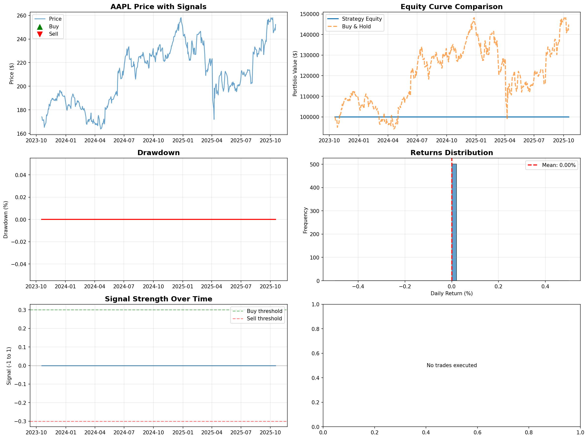

# 🚀 AI Market Intelligence Platform

A production-grade, professional stock market intelligence system featuring 18+ tools for market analysis, portfolio management, and AI-powered stock research.



## ✨ Features

### 🔬 Research & Analysis Tools
- **Professional Research Terminal** - Complete stock research & analysis with AI insights
- **AI Stock Picker** - AI-powered portfolio recommendations with optimal allocation
- **Comparison Matrix** - Compare up to 10 stocks across 17 key metrics
- **Historical Context** - 5-year trends and valuation context analysis
- **Investment Projection** - Calculate future value with multiple scenarios
- **Correlation Matrix** - Find correlations and hedging opportunities

### 📊 Market Intelligence
- **Market Overview** - Live indices, sectors, commodities, and breaking news
- **Live Dashboard** - Real-time market monitoring with auto-refresh
- **Sector Analyzer** - Track sector performance and leading stocks
- **Earnings Calendar** - Upcoming earnings reports and historical surprises
- **Dividend Tracker** - Monitor dividend yields and payment schedules

### 💼 Portfolio Management
- **Portfolio Manager Pro** - Track holdings, P&L, and portfolio metrics
- **Watchlist Pro** - Monitor stocks with customizable alerts
- **Stock Screener** - Find opportunities using multiple strategies
- **Technical Screener** - Identify bullish technical setups

### 🎯 Advanced Tracking
- **Insider Activity Tracker** - CEO/CFO purchases and cluster buying signals
- **Smart Money Tracker** - Institutional and hedge fund activity
- **Research Notes** - Save investment thesis and track ideas

## 🚀 Quick Start

### Prerequisites

- Python 3.8+
- API Keys (free):
  - [Alpha Vantage](https://www.alphavantage.co/support/#api-key)
  - [News API](https://newsapi.org/register)
  - [Financial Modeling Prep](https://financialmodelingprep.com/developer/docs/)

### Installation

1. **Clone the repository**
```bash
git clone https://github.com/yourusername/ai-market-intelligence.git
cd ai-market-intelligence
```

2. **Install dependencies**
```bash
pip install -r requirements.txt
```

3. **Set up API keys**
```bash
./setup_api_keys.sh
```

Or manually create `.env` file:
```bash
ALPHA_VANTAGE_KEY=your_key_here
NEWS_API_KEY=your_key_here
FMP_API_KEY=your_key_here
```

4. **Launch the platform**
```bash
./START_HERE.sh
```

Or use the quick launcher:
```bash
./run.sh
```

Or run directly:
```bash
python3 MAIN_MENU.py
```

## 📁 Project Structure

```
ai-market-intelligence/
├── apps/                          # All feature applications
│   ├── AI_STOCK_PICKER.py        # AI portfolio builder
│   ├── MARKET_OVERVIEW.py        # Market dashboard
│   ├── PORTFOLIO_PRO.py          # Portfolio manager
│   ├── WATCHLIST_PRO.py          # Watchlist tracker
│   ├── STOCK_SCREENER.py         # Stock screener
│   ├── TECHNICAL_SCREENER.py     # Technical analysis
│   ├── INSIDER_ACTIVITY_TRACKER.py  # Insider trading
│   ├── SMART_MONEY_TRACKER.py    # Institutional tracking
│   ├── COMPARISON_MATRIX.py      # Stock comparison
│   ├── CORRELATION_MATRIX.py     # Correlation analysis
│   ├── EARNINGS_CALENDAR.py      # Earnings tracker
│   ├── DIVIDEND_TRACKER.py       # Dividend calendar
│   ├── SECTOR_ANALYZER.py        # Sector analysis
│   ├── HISTORICAL_CONTEXT.py     # Historical trends
│   ├── INVESTMENT_PROJECTION.py  # Investment calculator
│   ├── LIVE_DASHBOARD.py         # Real-time dashboard
│   ├── PROFESSIONAL_RESEARCH_TERMINAL.py  # Research tool
│   ├── RESEARCH_NOTES.py         # Note taking
│   └── stock_universe.py         # S&P 500 stock data
│
├── scripts/                       # Utility scripts
│   ├── advanced_dashboard.py     # AI market dashboard
│   ├── bloomberg_terminal.py     # Bloomberg-style terminal
│   ├── quick_start.py            # Quick start guide
│   └── verify_installation.py    # Installation checker
│
├── src/                          # Core ML & analysis modules
│   ├── data/                     # Data fetching & processing
│   ├── ml/                       # Machine learning models
│   ├── api/                      # API integrations
│   ├── analysis/                 # Analysis tools
│   └── core/                     # Core utilities
│
├── docs/                         # Documentation
│   ├── GET_API_KEYS.md          # API key setup guide
│   └── *.md                      # Additional docs
│
├── assets/                       # Images and assets
│   └── *.png                     # Screenshots
│
├── config/                       # Configuration files
├── data/                         # Data storage
├── tests/                        # Test suite
├── notebooks/                    # Jupyter notebooks
│
├── MAIN_MENU.py                  # Main application launcher
├── START_HERE.sh                 # Professional launcher script
├── run.sh                        # Quick launcher
├── setup_api_keys.sh             # API key setup
├── requirements.txt              # Python dependencies
├── .env.example                  # Environment template
└── README.md                     # This file
```

## 🎯 Usage Examples

### 1. Research a Stock
```bash
python3 MAIN_MENU.py
# Select option 1 (Professional Research Terminal)
# Enter: AAPL
```

### 2. Build an AI Portfolio
```bash
python3 apps/AI_STOCK_PICKER.py
# Follow the interactive prompts
```

### 3. Compare Multiple Stocks
```bash
python3 apps/COMPARISON_MATRIX.py AAPL MSFT GOOGL NVDA
```

### 4. Screen for Value Stocks
```bash
python3 apps/STOCK_SCREENER.py
# Select criteria and strategy
```

### 5. Track Insider Activity
```bash
python3 apps/INSIDER_ACTIVITY_TRACKER.py
```

## 🛠️ Features by Category

### Market Data Sources
- Real-time and historical price data
- Financial statements and metrics
- News and sentiment analysis
- Insider trading data
- Institutional holdings
- Options data and derivatives
- Earnings reports and estimates

### Analysis Capabilities
- 17+ fundamental metrics comparison
- Technical analysis with 10+ indicators
- AI-powered stock scoring
- Correlation and covariance analysis
- Historical pattern recognition
- Valuation modeling
- Risk assessment

### Professional UI
- Bloomberg-inspired gray theme
- Rich terminal formatting
- Real-time auto-refresh
- Interactive menus
- Progress indicators
- Color-coded alerts

## 📊 Data Coverage

- **S&P 500**: All 503 stocks
- **Sectors**: 11 major sectors
- **Dividend Aristocrats**: 47 stocks
- **High Growth Tech**: 15+ stocks
- **FAANG+**: 8 mega-cap tech stocks
- **Mega Caps**: $500B+ market cap companies

## 🔧 Configuration

### Environment Variables
```bash
# .env file
ALPHA_VANTAGE_KEY=your_key
NEWS_API_KEY=your_key
FMP_API_KEY=your_key
```

### Customization
- Edit `apps/stock_universe.py` to modify stock lists
- Configure watchlists in `data/watchlist.json`
- Adjust portfolio in `data/portfolio.json`
- Modify themes in individual app files

## 🧪 Testing

Run the test suite:
```bash
pytest tests/
```

Verify installation:
```bash
python3 scripts/verify_installation.py
```

## 📚 Documentation

- [API Key Setup Guide](docs/GET_API_KEYS.md)
- [Feature Documentation](docs/)
- [System Architecture](docs/SYSTEM_ARCHITECTURE.md)

## 🤝 Contributing

Contributions welcome! Please:
1. Fork the repository
2. Create a feature branch
3. Make your changes
4. Submit a pull request

## 📝 License

MIT License - See LICENSE file for details

## 🙏 Acknowledgments

- Alpha Vantage for market data
- yfinance for Yahoo Finance integration
- News API for news aggregation
- Financial Modeling Prep for fundamental data

## 📧 Support

For questions or issues:
- Open a GitHub issue
- Check the documentation in `/docs`
- Review example scripts in `/scripts`

## 🎓 Educational Use

This platform is designed for educational and research purposes. Always conduct your own due diligence before making investment decisions.

---

**Built with** 🐍 Python | 📊 Rich | 🤖 Machine Learning | 💹 Financial APIs

*Professional-grade market intelligence at your fingertips*
