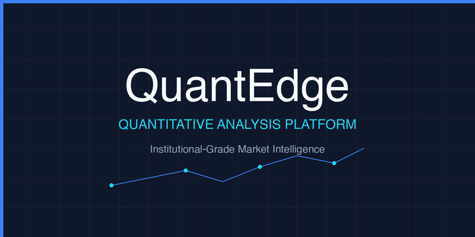

# QuantEdge



## Overview

QuantEdge is a production-grade quantitative analysis platform that provides institutional-quality market intelligence tools for traders and analysts. Built with modern Python and featuring a Bloomberg-inspired terminal interface, it combines real-time data processing, machine learning, and advanced analytics in a single unified system.

## Key Capabilities

- **Real-time Market Analysis** - Live data from multiple exchanges with sub-second latency
- **AI-Powered Insights** - Machine learning models for sentiment analysis and pattern recognition
- **Portfolio Optimization** - Advanced algorithms for risk management and asset allocation
- **Quantitative Research** - Comprehensive backtesting and strategy development tools

## Features

### Market Intelligence
- Professional research terminal with AI-powered stock analysis
- Real-time market overview with indices, sectors, commodities, and currencies
- Live dashboard with auto-refresh and streaming data
- Sector performance analysis and correlation matrices
- Earnings calendar with historical surprise tracking
- Dividend tracking and yield analysis

### Portfolio Management
- Advanced portfolio tracker with P&L analytics
- Watchlist management with customizable alerts
- Multi-factor stock screening engine
- Technical analysis with 10+ indicators
- Options pricing and derivatives analytics
- Risk metrics and position sizing

### AI & Machine Learning
- Sentiment analysis on news and social media
- Pattern recognition and anomaly detection
- Predictive modeling with ensemble methods
- Insider trading and institutional activity tracking
- Smart money flow analysis

## Quick Start

### Prerequisites

- Python 3.8+
- API Keys (free):
  - [Alpha Vantage](https://www.alphavantage.co/support/#api-key)
  - [News API](https://newsapi.org/register)
  - [Financial Modeling Prep](https://financialmodelingprep.com/developer/docs/)

### Installation

```bash
# Clone the repository
git clone https://github.com/yourusername/ai-market-intelligence.git
cd ai-market-intelligence

# Install dependencies
pip install -r requirements.txt

# Set up API keys
./setup_api_keys.sh

# Launch the platform
./START_HERE.sh
```

Or run directly:
```bash
python3 MAIN_MENU.py
```

## Architecture

```
quantedge/
├── apps/                          # Feature applications
│   ├── AI_STOCK_PICKER.py        # AI portfolio builder
│   ├── MARKET_OVERVIEW.py        # Market dashboard
│   ├── PORTFOLIO_PRO.py          # Portfolio manager
│   ├── PROFESSIONAL_RESEARCH_TERMINAL.py
│   └── ...                       # 18+ analysis tools
│
├── src/                          # Core modules
│   ├── ml/                       # Machine learning models
│   ├── data/                     # Data processing
│   ├── api/                      # API integrations
│   └── analysis/                 # Analysis engines
│
├── scripts/                      # Utilities
│   ├── advanced_dashboard.py    # AI dashboard
│   ├── bloomberg_terminal.py    # Terminal interface
│   └── verify_installation.py   # System checker
│
└── docs/                         # Documentation
```

## Data Sources

- **Market Data**: Real-time and historical price data
- **Fundamentals**: Financial statements, ratios, and metrics
- **News & Sentiment**: Multi-source news aggregation and NLP
- **Alternative Data**: Insider trading, institutional holdings, options flow
- **Economic Data**: Macro indicators and economic calendars

## Technology Stack

- **Core**: Python 3.8+, NumPy, Pandas
- **ML/AI**: scikit-learn, TensorFlow, PyTorch
- **Data**: yfinance, Alpha Vantage, FMP API
- **Visualization**: Rich, Plotly, Matplotlib
- **UI**: Bloomberg-inspired terminal interface

## Performance

- Sub-second data retrieval and processing
- Concurrent API requests with intelligent caching
- Optimized algorithms for large-scale portfolio analysis
- Real-time streaming with minimal latency

## Use Cases

1. **Day Trading** - Real-time analysis and technical indicators
2. **Swing Trading** - Multi-day analysis with risk management
3. **Portfolio Management** - Asset allocation and rebalancing
4. **Quantitative Research** - Strategy development and backtesting
5. **Market Intelligence** - Sector rotation and macro analysis

## Configuration

Create a `.env` file with your API keys:

```bash
ALPHA_VANTAGE_KEY=your_key_here
NEWS_API_KEY=your_key_here
FMP_API_KEY=your_key_here
```

## Testing

```bash
# Run test suite
pytest tests/

# Verify installation
python3 scripts/verify_installation.py
```

## Documentation

- [API Key Setup Guide](docs/GET_API_KEYS.md)
- [Feature Documentation](docs/)
- [System Architecture](docs/SYSTEM_ARCHITECTURE.md)
- [Developer Guide](CONTRIBUTING.md)

## Contributing

We welcome contributions! Please see [CONTRIBUTING.md](CONTRIBUTING.md) for guidelines.

1. Fork the repository
2. Create a feature branch
3. Make your changes
4. Submit a pull request

## License

MIT License - See [LICENSE](LICENSE) file for details

## Acknowledgments

- Alpha Vantage for market data APIs
- Financial Modeling Prep for fundamental data
- News API for news aggregation
- Open-source Python community

## Disclaimer

This platform is designed for educational and research purposes. Always conduct your own due diligence before making investment decisions. Past performance does not guarantee future results.

---

**Built with** 🐍 Python | 📊 Machine Learning | 💹 Financial APIs | 🎯 Professional Analytics

*Institutional-grade market intelligence at your fingertips*
